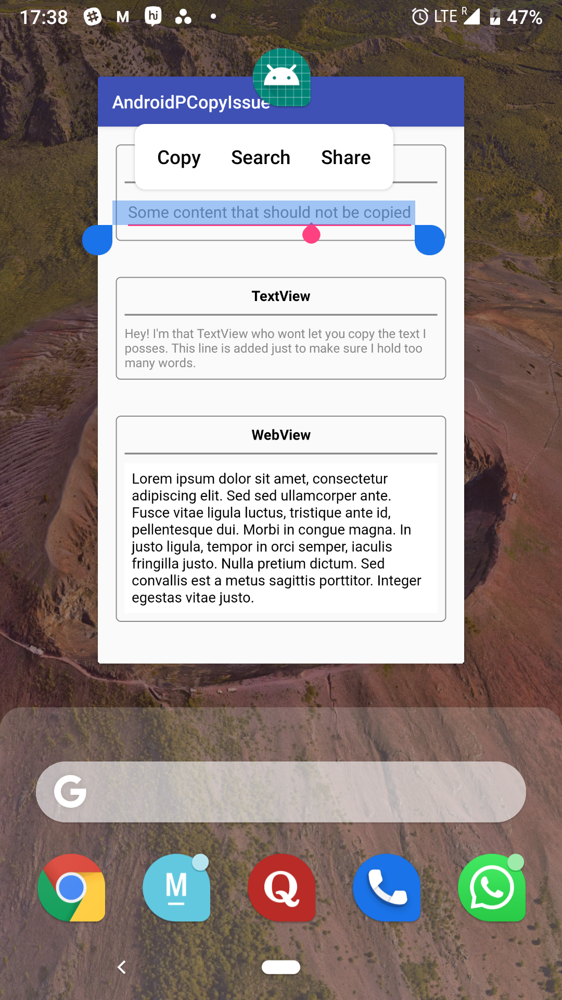
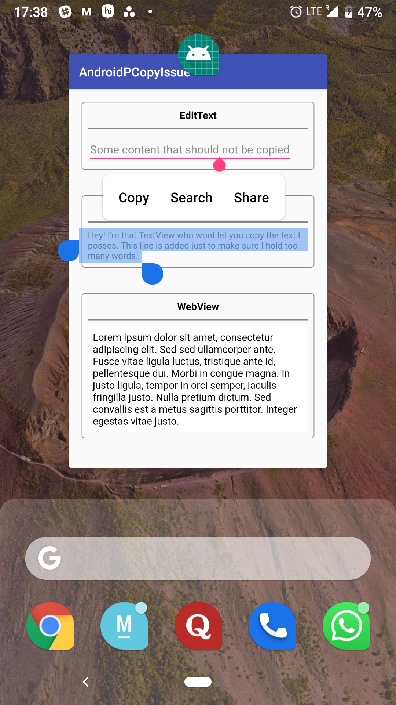
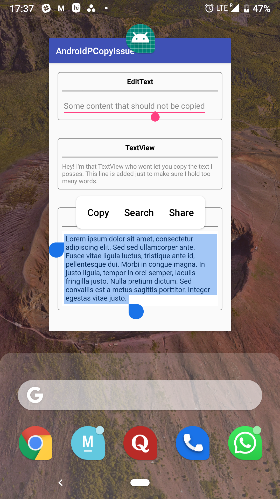

# AndroidPCopyIssue

Issue : Switch app mode in Android P let the user to long press any text and allows to do the Cut/Copy options which is NOT allowed normally when the app is fully focused

## Screenshots

|     EditText Copy Enabled     |   TextView Copy Enabled       |   Webview Copy Enabled       | 
| ----------------------------  | ----------------------------- | ---------------------------- | 
|  |    |    |

## Issue Reference 

<a href='https://issuetracker.google.com/issues/116673796'>https://issuetracker.google.com/issues/116673796</a>
